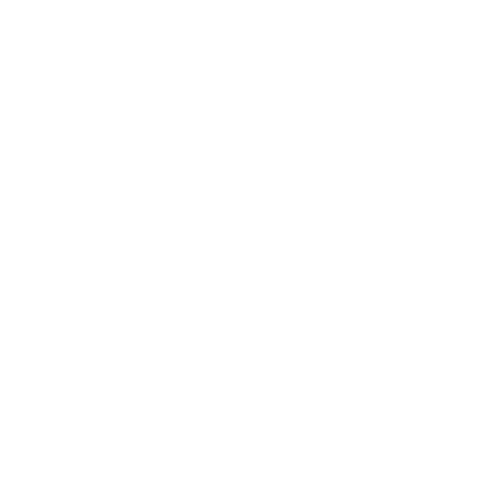

<p align="center">
  
</p>

<h1 align="center">Learn. · Build. · Launch.</h1>

<p align="center">
  Pure Astro static site for the <strong>AWS Student Builder Group</strong> at Universidad Politécnica de Yucatán
</p>

<p align="center">
  <a href="https://astro.build/">
    
  </a>
  <a href="https://tailwindcss.com/">
    
  </a>
  <a href="https://aws.amazon.com/amplify/">
    
  </a>
  <a href="https://www.typescriptlang.org/">
    
  </a>
</p>

---

## About

The **AWS Student Builder Group UPY** website is the official landing page for our student community at [Universidad Politécnica de Yucatán](https://www.upy.edu.mx/). We help students learn, build, and grow together using Amazon Web Services — through workshops, hackathons, certification paths, and collaborative projects.

The site uses a **neo-brutalist builder aesthetic**: hard borders, solid color shadows, a white hero with the SBG logo, a terminal-style panel, and the official AWS Student Builder Group color palette.

### Partners

<p align="center">
  
  &nbsp;&nbsp;
  
</p>

---

## Tech stack

| Layer | Technology |
|-------|------------|
| Framework | [Astro 7](https://astro.build/) — static output |
| Styling | [Tailwind CSS 4](https://tailwindcss.com/) + custom builder utilities |
| UI tokens | [HeroUI styles](https://www.heroui.com/) (event pages) |
| Content | JSON + Markdown pairs for events |
| Email | HTML templates in `/mail/` |
| Hosting | [AWS Amplify Hosting](https://aws.amazon.com/amplify/) |

---

## Brand & typography

Typography is loaded from the official **Amazon Ember** family hosted on S3 (`aws-sbg-resources`), matching `src/styles/global.css`:

| Role | Font family | S3 source |
|------|-------------|-----------|
| Body | Amazon Ember | `Fonts/AmazonEmberDisplay_Rg.ttf` · `Fonts/AmazonEmberDisplay_Bd.ttf` |
| Display headings | Amazon Ember Display | Full weight set in `Fonts/AmazonEmberDisplay_*.ttf` |
| Code / terminal | Amazon Ember Mono | `Fonts/AmazonEmberMono_Rg.ttf` · `Fonts/AmazonEmberMono_Bd.ttf` |

Base URL: `https://aws-sbg-resources.s3.us-east-1.amazonaws.com/Fonts/`

### Color palette

| Token | Hex | Usage |
|-------|-----|-------|
| Mint | `#00e582` | Primary accent |
| Cloud | `#42b4ff` | Links & secondary accent |
| Grape | `#ad5cff` | Highlights |
| Sunset | `#ff9900` | Warm accent |
| Bubble | `#ff57e9` | Tertiary accent |
| Ink deep | `#0d1219` | Page background |
| Ink | `#161d26` | Surfaces |
| Paper | `#f2f6f9` | Text & borders |

### Decorative vectors

Official AWS Student Builder Group icons used across the site live in `public/vectors/`:

`bolt-blue` · `bracket-smile-mint` · `bracket-smile-white` · `clock-blue` · `drop-mint` · `key-amber` · `ladder-purple` · `speaker-magenta` · `teams-blue` · `teams-mint` · `trophy-amber` · `trophy-purple` · `wrench-blue`

Full-color source files are also available in `/vectors/` at the repo root.

---

## Getting started

### Prerequisites

- **Node.js** 18+ (20 LTS recommended)
- **npm** 9+

### Install & run

```bash
git clone https://github.com/AWS-Student-Builder-Group-UPY/website.git
cd website
npm ci
npm run dev
```

Open [http://localhost:4321](http://localhost:4321).

### Scripts

| Command | Description |
|---------|-------------|
| `npm run dev` | Start the Astro dev server |
| `npm run build` | Build static output to `dist/` |
| `npm run preview` | Preview the production build locally |

---

## Project structure

```
website/
├── public/
│   ├── brand/logo.svg          # Favicon & navbar logo
│   ├── logos/                  # AWS, UPY
│   ├── vectors/                # SBG decorative icons (used in components)
│   ├── team/                   # Team member photos
│   ├── events/                 # Event assets (.ics, thumbnails)
│   └── fonts/                  # Local font copies (S3 is canonical in prod)
├── src/
│   ├── components/             # Page sections (Hero, About, Events, Team…)
│   ├── content/events/         # Event JSON + Markdown pairs
│   ├── layouts/Layout.astro    # Base HTML shell + scroll reveal
│   ├── lib/events.ts           # Event loader & date formatting
│   ├── pages/
│   │   ├── index.astro         # Home
│   │   └── eventos/            # Events index + [slug] detail pages
│   └── styles/global.css       # Fonts, palette, builder utilities
├── mail/                       # Branded HTML email templates
├── vectors/                    # Full SBG icon library (all color variants)
├── astro.config.mjs
└── amplify.yml                 # AWS Amplify build spec
```

---

## Adding events

Each event is a **JSON + Markdown pair** with the same slug under `src/content/events/`:

```
src/content/events/
  my-event.json    ← metadata (date, venue, agenda, Meetup URL…)
  my-event.md      ← narrative body in Markdown
```

### Quick start

```bash
cp src/content/events/_template/event.json src/content/events/my-event.json
cp src/content/events/_template/event.md   src/content/events/my-event.md
```

1. Edit `my-event.json` with event metadata.
2. Write the story in `my-event.md` (paragraphs, bold, lists).
3. Optionally add a calendar file at `public/events/my-event.ics`.
4. Push to `main` — Amplify rebuilds automatically.

Set `"published": false` in JSON to hide an event without deleting it.

See [`src/content/events/README.md`](src/content/events/README.md) for field reference (Spanish).

---

## Email templates

Branded invitation and notification HTML lives in `/mail/`:

| File | Purpose |
|------|---------|
| `_base.html` | Shared layout shell |
| `kickoff-2026-invitacion.html` | Event invitation example |
| `recordatorio-evento.html` | Event reminder |
| `bienvenida-club.html` | Welcome email |
| `brand.config.json` | Colors, fonts (S3 URLs), social links |

Font URLs in `brand.config.json` point to the same S3 bucket used by the site.

---

## Deployment

The site deploys to **AWS Amplify Hosting** on every push to the connected branch.

Build pipeline (`amplify.yml`):

1. `npm ci`
2. `npm run build`
3. Publish `dist/` as static artifacts

No server runtime is required — Astro is configured with `output: 'static'`.

---

## Connect with us

| Platform | Link |
|----------|------|
| Meetup | [aws-sbg-at-universidad-politecnica-de-yucatan](https://www.meetup.com/aws-sbg-at-universidad-politecnica-de-yucatan/) |
| Instagram | [@aws.upy](https://www.instagram.com/aws.upy/) |
| LinkedIn | [AWS UPY](https://www.linkedin.com/company/aws-upy) |
| Linktree | [linktr.ee/aws.upy](https://linktr.ee/aws.upy) |

---

## Disclaimer

© AWS Student Builder Group UPY · Universidad Politécnica de Yucatán.

This project is a student community website and is **not officially affiliated** with Amazon Web Services, Inc.
